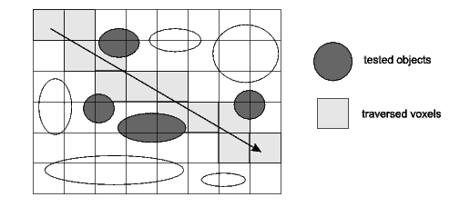
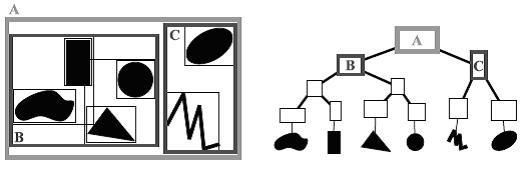
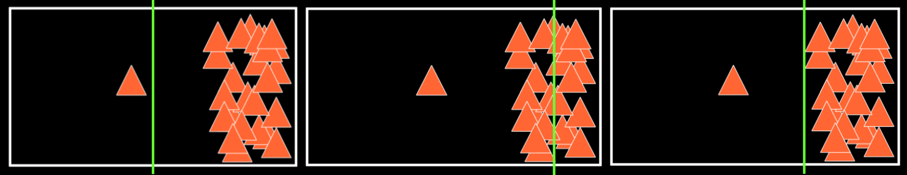
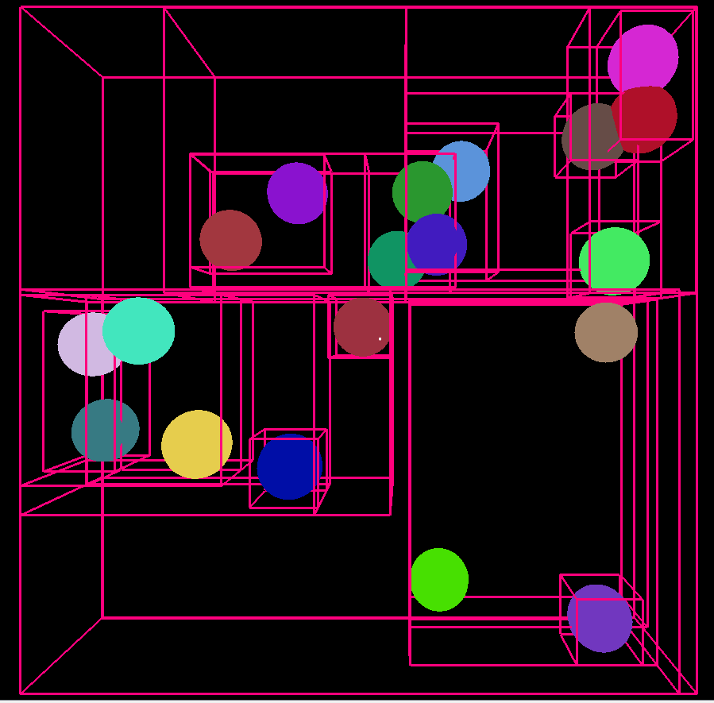
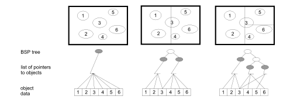
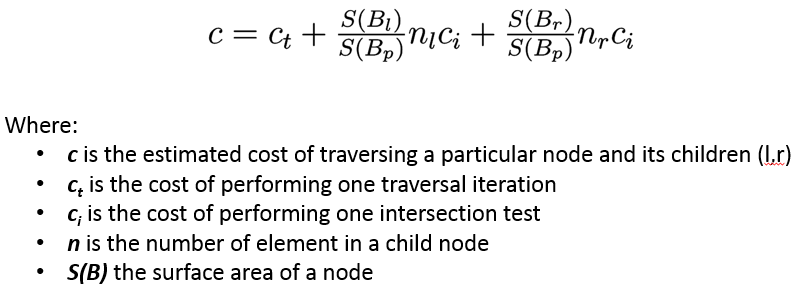

.. accelerators:

=======================================
Accelerating structures for efficient intersection computation
=======================================

:summary: This section discusses the different accelerating 
          structures used to efficiently compute the 
          intersections of the rays with the scene.

The intersection computation problem
=======================

The ray tracing simulation needs to find the obstacle encountered by every
ray. The naive approach consists in performing intersection tests between
every ray and all the primitives of the scene. For a single ray, the complexity
of this algorithm is O(N) where N is the number of primitives. Though this is
acceptable for small scenes, this is too costly in realistic scenarios where
scenes are composed of tens of thousands of triangles.

For this reason, a lot of efforts have been put into designing structures that
can reduce the complexity of computing intersections of a ray with the
primitives of a scene. The idea is to organize the primitives in such a way
that it is not necessary to perform intersection tests for all of them.

The overhead of building these accelerating structures can be done with O(N x
log(N)) complexity. Then, they can be used for each ray to compute
intersections in O(log(N)).

Most of the information on this page comes from Mathieau Dreher's Master
thesis (ref: Développement d’un lancer de rayons 3D générique pour
l’acoustique et intégration dans Tympan. Mathieu Dreher 2011)

The different kinds of accelerating structures implemented in code Tympan
=======================

Brute force
------------

The *brute force* accelerator corresponds to the naive approach of testing
each primitives of the scene for intersection. It is used to find
intersections with receptors wich are placed in a seperate scene.

Uniform grid
------------

This approach consists in dividing the scene in a uniform grid of cells also
called voxels. Each time the ray enters a new voxel an intersection test is
performed on each primitive in the cell. Once all the primitives in a cell
have been tested, the algorithm moves on to the neighboring which is
determined by the side from which the ray exited the current cell.

   **Uniform grid traversed by a ray**

The main advantages of this approach is that it is conceptually easy to
understand and given any primitive we can quickly find which cell(s) it
belongs to when building the grid.

The drawback of this method is that the different cells can contain a very
different amount of primitives. In the most extreme case, all cells are empty
except one that contains all the primitives. Another problem is that
primitives can belong to several cells. This can result in the same primitive
being tested multiple time for intersection.

Although the worst case scenario is unlikely, the triangulation algorithm used
to build the scene tends to produce triangles of very different sizes. Indeed,
flat regions will be composed of big triangles whereas the surroundings of
buildings will be made of many small ones.

Bounding Volume Hierarchy
------------

The *Bounding Volume Hierarchy* (BVH) is an adaptive structure that uses a
tree to build a hierarchy of bounding boxes. Instead of dividing the space of
the scene like the Uniform Grid approach, this strategy divides the set of
primitives.

This structure is built as follows:
	- We first create the root of the tree which contains all primitives
	- Then, we create two children by splitting the list of primitives of the current node in two sublists
	- The process is applied recursively until some stoping criterion is met (number of primitives per leaves or maximum tree depth)

   **Representation of primitives in a hierachy of bounding volumes**

Finding the primitives intersected by the ray is done by, starting at the root
node, following the branches of the tree as long as the ray intersects the
corresponding bounding boxes. When a leaf is reached, intersection tests are
performed between the ray and the primitives contained in the sublist.

The list of primitives of each node can be split according to different strategies:
	- Split the volume in the middle of one of its axes (usually we pick the biggest axis)
	- Split the list of primitives around its median
	- Split the list of primitives according to some cost function (e.g Surface Area Heuristic)

   **Split strategies - Left: Middle split, Center: Median split, Right: SAH split**

The BVH accelerating structure as the advantage of being adaptive, not
creating any empty node and only containing one instance of each primitive.

Its drawbacks are that the bounding boxes of different nodes can overlap. This
means that the traversal cannot be stopped at the first intersection
encountered because a closer one might be discovered when exploring the rest
of the tree. Also, the size of the bounding boxes depends on the size of the
primitives, which means that big triangles will have big bounding boxes. This
creates big leaves and big internal nodes increasing the likelihood of the
traversal engaging in parts of the tree for which there are no real
intersections to be found.

   **Example of subdivision of the volume with 10 spheres using the median**

Kd-tree
------------

The Kd-tree accelerating structure is very similar to the BVH, but instead of
dividing the set of primitives id divides the space. Indeed, each node of the
tree is split into two smaller ones by dividing the volume of the current one in
two parts according to some plan carried by one of the canonical axes.

As for the BVH approach, the position of the dividing plan can be determined through 3 different strategies:
	- Sort the primitives of a node along one of the axes and use the position of the median primitive
	- Take the middle of the biggest axis
	- Use a cost function such as the *Surface Area Heuristic* (SAH)

   **Example of a kd-tree using with the middle split strategy**

Unlike the BVH approach, a Kd-tree can contain multiple references to the
same primitive (if it crosses one of the dividing plans). The main advantage
of this approach is to be adaptive while still allowing a front-to-back
traversal (i.e, the traversal can be stopped at the first intersection
encountered).

The kd-tree is built recursively. This implies that every sub-tree must be
constructed before picking the most efficient structure. In practice, a lot of
approximations chose to consider that only a simple leaf is added instead of a
sub-tree, hence avoiding to deal with the recursion.

Though is construction time is considered by some to be to heavy, the kd-tree
is regarded as the optimal accelerating structure for offline rendering (ref:
Vlastimil Havran. Heuristic Ray Shooting Algorithms. Ph.d. thesis, Department
of Computer Science and Engineering, Faculty of Electrical Engineering, Czech
Technical University in Prague, November 2000).

Surface Area Heuristic
------------

The *Surface Area Heuristic* is based on the idea that, for an infinite amount
of rays, the probability of hitting a particular volume is proportional to its
area. It uses the area of the primitives contained in a node to estimate where
the dividing plan should be put in order to minimise the cost of traversal.

The cost of a particular sub-tree corresponds to the cost of traversing the
node (e.g bounding box intersection) plus the cost of intersecting its two
children weighted by their probability of being hit by a ray. It is computed
with the following formula:

This cost function gives us a criterion to stop building the tree: a node is
split in two if the cost of adding two sub-trees is higher than the cost of
adding a leaf.

.. figure:: _static/built_resources/SAH.png
   :align: center
   :width: 25 % 

   **Example of a subdivision of the space with a kd-tree using the SAH cost function**

