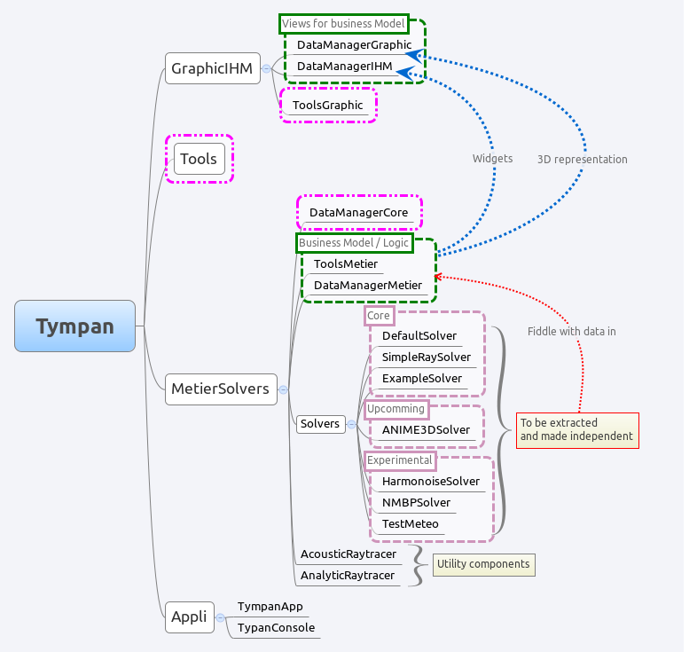
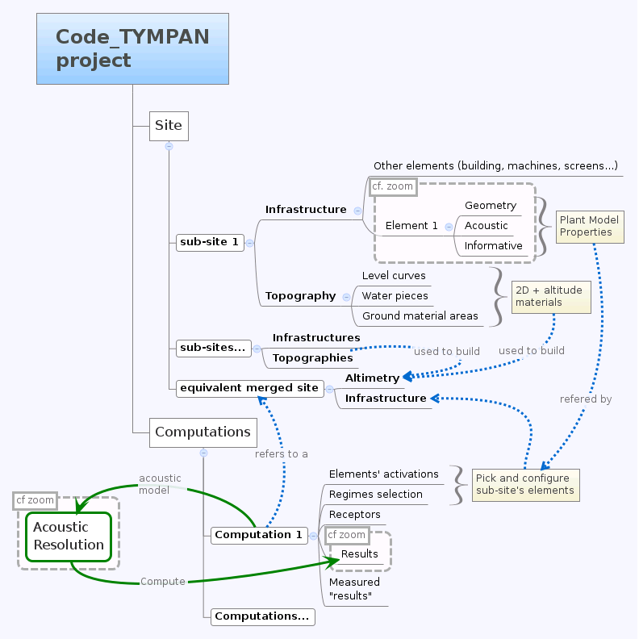
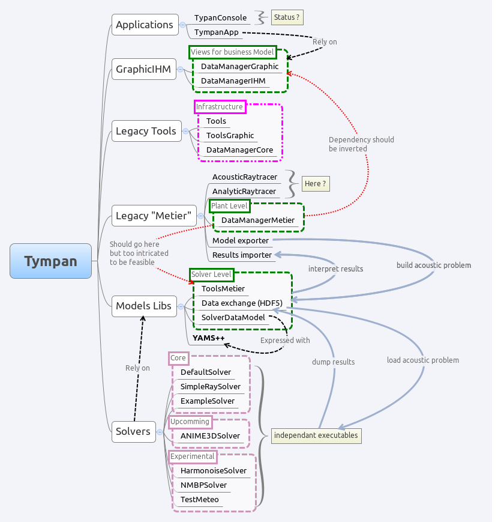

.. _dev-architecture:

Architecture
============

This part deals with the description of the Code_TYMPAN architecture. Each
section represents a part of the code: GUI, tools, etc. and describes how the
code is organized:

  - main organization of the code and the different part ;
  - some dependencies between these different parts ;
  - what kind of objects you will find in the different part ;
  - the present and the future of the Code_TYMPAN architecture.

Code_TYMPAN is made of different parts: core & tools, business logic, graphical
user interface and solvers.

.. note::

   A refactoring is planned. Read the section `Future Architecture`_ about this
   issue.

The schema of the current architecture:



   Current architecture schema

.. todo:: write a legend for the previous schema

.. todo:: update this diagram: no more TympanConsole, make python qprocess appear
   (on the diagram of the future archi too)

.. todo:: is it still necessary to keep these two parts: current and future architecture,
   since now we are in a state somewhere between the two?

.. note::

   The main Code_TYMPAN executable to launch the application is in the
   ``gui/app`` directory. Other directories are dedicated to build
   libraries or plugins (for the solvers).


Core and Tools
--------------

See the ``Tools`` directory and some sub-directories in ``MetierSolver``:

  - ``DataManagerCore``: the main base class ``TYElement`` used for every
    business logic objects. Also implements an interface for the solvers and some
    XML tools in order to export/import a Code_TYMPAN study ;
  - ``CommonTools`` common objects used by the `Business Logic`_ objects: point,
    vector, matrix, etc.

The rationale behind the creation of ``CommonTools`` is to provide
basic representations and utilities which *do not depend* upon
``TYElement`` nor ``OPrototype``. Typically such representations and
utilities are likely to be shared between the main application and the
solvers.

The way the CGAL library is used deserves a special explanation. CGAL
is a very powerful but quite complex templates-based library. As such
dependency to CGAL appears in the headers of the client code and this
has a heavy impact on compilation time and apparent code complexity.

In order to mitigate those drawbacks while benefiting from the CGAL
features a variant of the classical Bridge* design pattern is used
(For design pattern the key reference is [DPGoF]_ ).

Namely the ``cgal_tools`` module in ``CommonTools`` builds some
high-level functionality (constrained triangulations and domain
meshing) upon CGAL features ; its API relies on CGAL types and does
not depend on other Tympan types.

The ``cgal_bridge`` module in ``DataManagerMetier`` exposes interfaces
to those features expressed with the main Tympan datatypes and ensures
the conversions.

This allows independent development and testing and reduces
compilation times by breaking header dependencies propagation thanks to
the bridge between the interfaces seen by the client code and the
implementation.

.. [DPGoF] *Design Patterns*
           E. Gamma, R. Helm, R. Johnson, J. Vlissides - Adisson-Wesley

Business Logic
--------------

.. note::

   *Business Logic* is the part of the code which is not technical. Deal with
   "real life" models: buildings, machine, fields, etc.

See the different sub-directories in ``MetierSolver/DataManagerMetier``:

  - ``DataManagerMetier``: objects which describe a site, acoustic objects
    (sources, receptor, paths), materials, machines, etc.
  - ``SolverDataModel``: the current work which describes a data model for the
    solvers. This is a part of the `Future Architecture`_;

Code_TYMPAN offers a way to build the ``DataManagerMetier`` objects from
a string representing their class name. This feature (mostly used during XML
deserialization) is implemented in the ``OPrototype`` class through a factory
pattern. To use this facility, it is first necessary to register all the objects
that will need it. This is handled by the ``init_registry()`` method
(from ``Tympan/MetierSolver/DataManagerMetier/init_registry.h``), that must be
ran before any call to the methods specified by ``OPrototype`` interface.

For now, the splitting between the business logic objects and the `Graphical User
Interface`_ is not clear. In other words, you can have a strong dependency
between ``MetierSolver/DataManagerMetier`` and graphical widgets described in
``gui/widgets``. One of the objectives described in the section
`Future Architecture`_ is to split these parts.


Graphical User Interface
------------------------

See in ``gui`` and its three sub-directories:

 - ``ToolsGraphic`` common tools and objects used for the GUI ;
 - ``DataManagerIHM`` widgets such as buttons, boxes and some widgets dedicated
   to a specific business logic objets such as a building, a field, a spectrum,
   etc. ;
 - ``DataManagerGraphic`` 3D representation of business logic objecst such as a
   building, a machine, etc.

Rendering
`````````

The OpenGL API is used to render the scene geometry. The application uses immediate mode and
display lists, these methods are from an old specification of OpenGL and are now deprecated.
When immediate mode is used, the server (GPU) wait for the client (CPU) to send the geometry.
This method is slow because the GPU has to wait for all the data to be transferred.
The rendering function of each business logic object is located in ``gui/gl``
and simple geometry rendering can be found at ``gui/tools``.

In order to make the rendering faster, the OpenGL commands can be compiled and stored on the GPU.
That way, the CPU simply has to tell the GPU to render this display list instead of sending the
geometry on each frame. The use of displayList can be found at ``gui/app/TYOpenGLRenderer.cpp``.
It simply encapsulates all the rendering function (immediate mode) of the scene.

The modern way to render things in OpenGL relies on the use of VBO's (Vertex Buffer Object). The idea is
to store the geometry on the GPU as compact arrays (of vertices, indices, normals, ...). One advantage over
the display list is that you can access these buffers and edit the data in a dynamic way, whereas display
lists are static, in a sense that when the geometry changes you have to recompile/send the whole display
list again.

The matrix management of the application relies on the OpenGL matrices, by using functions such as
glRotate(), glTranslate(), ... Additionally, the matrix management of OpenGL features a stack of
matrices (glPushMatrix(), glPopMatrix()).
The goal of OpenGL is to take advantages of the "**GPU**", but all the functions that implies matrix
operations are done on the "**CPU**", they are now deprecated and should be done by the application
itself and not the OpenGL API. There exist many libraries that feature matrix management (CGAL? Qt?).

Picking
```````

The picking is entirely done on the GPU by using a name stack and a selection buffer.
This method relies on OpenGL deprecated functions and the steps are as follows:

 #. We define a small "*picking window*"(5 pixel width) and we enter selection mode
    (a mode where the resulting rendering won't be displayed).
 #. We give a "*name*" (an integer) to each object we are willing to pick/draw.
 #. The objects are then rendered. If a primitive falls inside the "*picking window*", a "*hit*" occurs.
 #. For each "*hit*", the primitive with the smallest z-value (the closest one) is chosen.

The algorithm is located in the ``gui/app/TYElementPicker.cpp`` file.

.. note::

   Actually, numerous names can be given to a primitive, that's the reason why a stack is used.
   It enables the programmer to pick objects as a hierarchical structure.

There are two principal different ways of doing picking :

  - color picking ;
  - ray intersection.

The color picking uses entirely the GPU once again. We render every objects with an unique
color, then we read the color of the pixel under the mouse. This technique is straightforward and should
be simple to implement, however we can't get the coordinate of the intersection point.

The other method consists of a ray that we cast on the scene, and then perform ray-intersection
test against the object of our scene. Usually, the ray go through an acceleration structure (e.g. grid,
octree, k-d tree, etc), before being tested with the bounding box of the object. This method usually
run on the CPU and is independant of the rendering API. It is easy to know the exact intersection
point between our ray and the picked object.

.. note::

   It might be possible to re-use the acceleration structures from ``MetierSolver/AcousticRaytracer/Accelerator`` for the ray-intersection method.

Solvers
-------

All directories in ``MetierSolver/Solvers`` and
``MetierSolver/AcousticRaytracer``. The sub-directories in ``AcousticRaytracer``
is dedicated to the solver named *Simple Ray Solver* but does not occur in the
``Solvers`` directory.


Appli
-----

The ``Appli`` package is the place where the simulation workflow is split in
order to delegate some of the processing to a Python subprocess (see ``launch()``
method from ``TYCalculManager`` class).
When asked to perform a simulation, the computation manager:

* Serializes the current project to a XML file
* Calls a subprocess running ``solve_project.py`` python script that uses tympan libraries to:

  * Read the serialized file
  * Build a data model representing the acoustic problem (see details below, section **Future Architecture**)
  * Run the simulation
  * Serialize the computed project (with the results)
* Reads the simulation results from the file serialized by the Python subprocess
* Updates the current project with these results


Future Architecture
-------------------

One proposes to improve the current architecture in order to clearly split
independent features. For instance, the business logic should not have a
dependency on the graphical user interface (as previously described). Moreover,
the separation between core/tools and the business logic is not clear. The main
idea is to split:

  - the graphical user interface ;
  - business logic ;
  - several solvers: Default, ANIME3D, Simple Ray Solver, etc.

Some tasks have already been started:

 #. Make a dedicated data model for the solver part (see class ``AcousticProblemModel``),
    i.e. create elementary
    objects (as opposed to business objects) such as acoustic sources and receptors,
    triangles related to a material, spectrums, etc. in order to
    define a model that can be used by any solver.
 #. Change the core simulation workflow in order to have a clear separation
    between the business logic and the solvers.
    In other word, rewrite the solvers (starting from the default solver) to
    make them use the new data model aforementioned, which is built from the
    business representation of the site just before the computation.
 #. Build the solver data model from the Python subprocess by going through the
    current site and computation and extracting relevant data.

Here a schema about the splitting between site elements and the computation ---
separate the business logic related to a site with the way to solve the acoustic
problem. A computation needs triangles with materials from a site triangulation,
acoustic sources/receptors and an altimetry.



   Proposal of the futur architecture


About the future architecture, take a look at the following schema.



   Proposal of the futur architecture

.. note::

   This is just a proposal for the future architecture. It may be modified
   later.

.. todo:: write a legend for the two previous schemas
