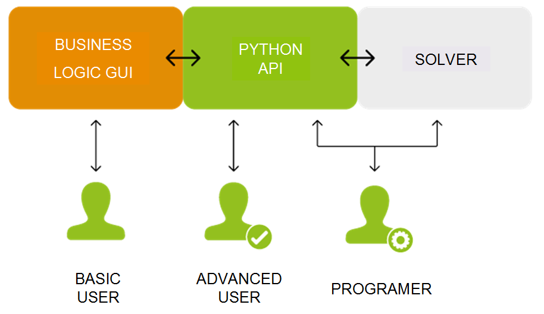
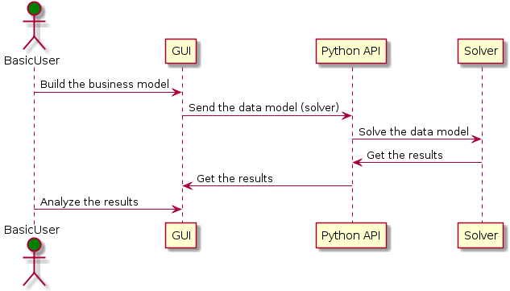
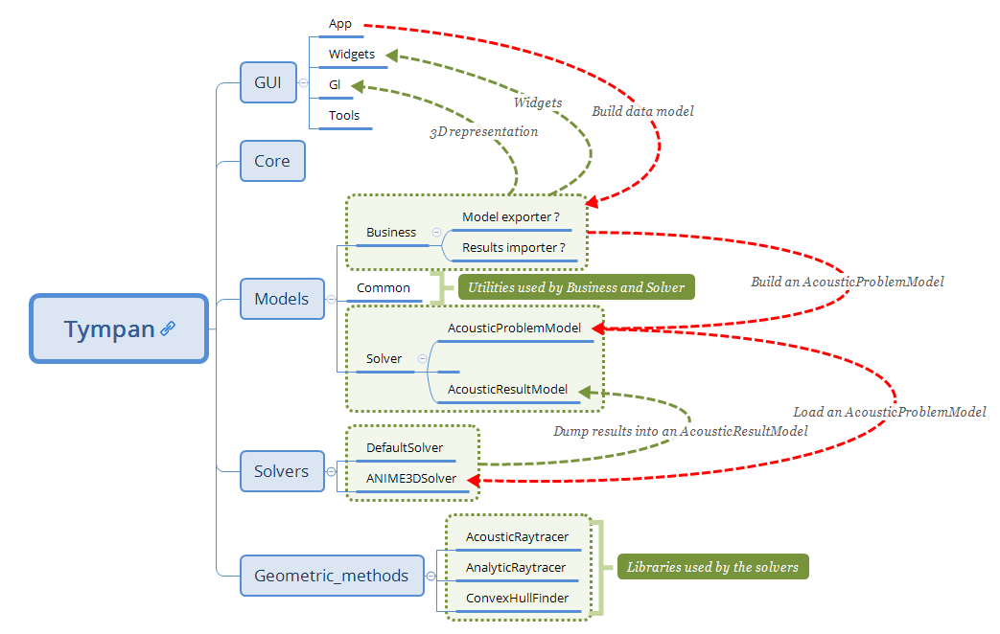
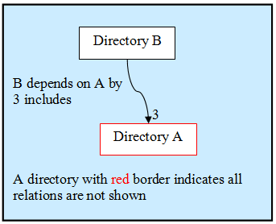
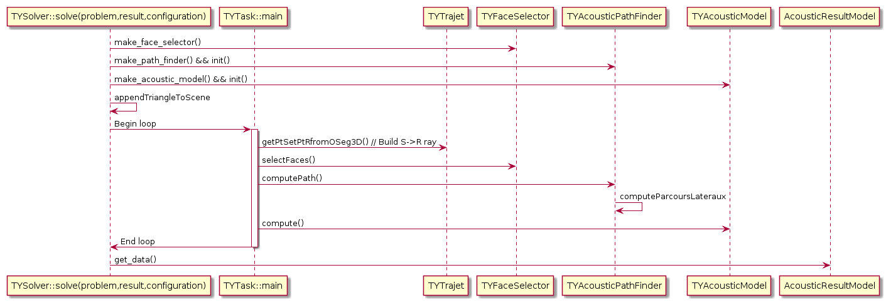
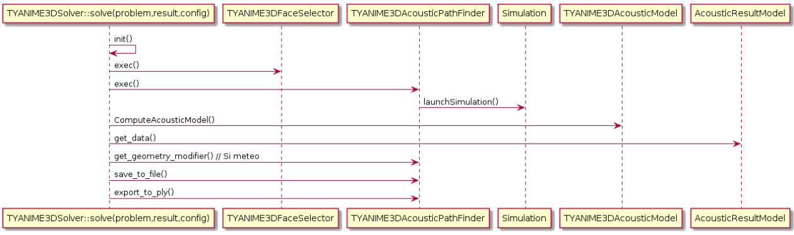
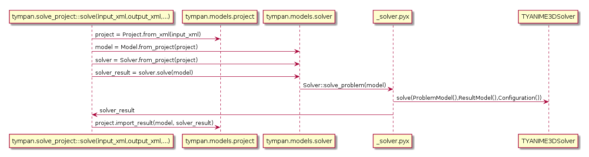

.. _dev-architecture:

Architecture (4.x version)
==========================

Introduction
------------

This part deals with the description of the Code_TYMPAN architecture. Each
section represents a part of the code and describes how it is organized:

  - main organization of the code and the different parts
  - some dependencies between these different parts
  - what kind of objects you will find in the different part

Description
-----------

Code_TYMPAN is made of different parts: 

  - core&tools
  - graphical user interface
  - business logic
  - solvers 

An API in Python is used to communicate between the Graphical User Interface (GUI) and the solvers.

Three classes of users may interact differently with Code_TYMPAN:

  - The basic user will use the GUI which builds the data models and run a calculation through the API
  - The advanced user may drop the GUI and runs a build the model/run the calculation with the API
  - At least, the programer will add new solvers/features on the C++ solver part and the API part



   **Parts separation in the 4.x architecture and how different users interact with Code_TYMPAN**


.. UML graph
   @startuml
   actor BasicUser as U #green
   participant "GUI" as G
   participant "Python API" as P
   participant "Solver" as S
   U->G : Build the business model
   G->P : Send the data model (solver)
   P->S : Solve the data model
   S->P : Get the results
   P->G : Get the results (update the business model)
   U->G : Analyze the results
   @enduml

   
   **Sequence example for a basic user**

.. UML graph2
   @startuml
   actor AdvancedUser as U #orange
   participant "Python API" as P
   participant "Solver" as S
   U->P : Build the data model (solver)
   P->S : Solve the data model
   S->P : Get the results
   @enduml

.. .. figure:: _static/built_resources/AdvancedUser.png
   :align: center
   :scale: 100 % 
   
   **Advanced user**

.. UML graph3
   @startuml
   actor Programmer as U #red
   participant "Python API" as P
   participant "Solver" as S
   U->S : Add a new feature (solver for instance)
   U->P : Update the API to access the new feature
   @enduml
   
.. .. figure:: _static/built_resources/Programmer.png
   :align: center
   :scale: 100 % 
   
   **Programmer**

If we have a look on the source directories (folders) of the differents parts, the main relations in the current architecture are: 


   
   **Current architecture schema (ToDo: update)**

Here a second graph about the splitting between site elements (business logic) and the computation (solvers).
It separates the business logic related to a site with the way to solve the acoustic problem (`tympan::AcousticProblemModel <../doxygen/html/classtympan_1_1AcousticProblemModel.html>`_). 
This solver data model, which can be used by any solver, is built from the Python subprocess by going through the
current site and extracting relevant data: a computation needs triangles with materials from a site triangulation,
acoustic sources/receptors and an altimetry.

.. figure:: _static/built_resources/SiteBDM.png
   :align: center
   
   **Target architecture schema**
   
At the Tympan sources root, we find four directories:
  - ``core``: Several tools classes
  - ``models``: Data model for solvers and business logic
  - ``gui``: Graphical User Interface
  - ``solvers``: Solvers

.. figure:: _build/doxygen/html/dir_0a699452fb3f72206b671d5471a45d39_dep.png
   :target: ../doxygen/html/dir_0a699452fb3f72206b671d5471a45d39.html
   :align: center
   :scale: 100 % 
   
   **Main directories and dependencies**
   
As several dependency graphs will be used below, we explain how it should be read:


   
   **Doxygen rules for dependency graph**   
   
Core and Tools
--------------

See the ``core`` and ``gui/tools`` directories and some sub-directories in ``models`` directories:

  - ``models/business``: the main base class `TYElement <../doxygen/html/classTYElement.html>`_ used for every
    business logic objects. Also implements an interface for the solvers and some
    XML tools in order to export/import a Code_TYMPAN study ;
  - ``models/common``: common objects used by the `Business Logic`_ objects: point,
    vector, matrix, etc.

.. figure:: _build/doxygen/html/dir_5dbfaf92f958cca7bf9f388ebf56af42_dep.png
   :target: ../doxygen/html/dir_5dbfaf92f958cca7bf9f388ebf56af42.html
   :align: center
   :scale: 100 % 
   
   **models directories and dependencies**

The rationale behind the creation of ``models/common`` is to provide
basic representations and utilities which *do not depend* upon
`TYElement <../doxygen/html/classTYElement.html>`_  nor `OPrototype <../doxygen/html/classOPrototype.html>`_. Typically such representations and
utilities are likely to be shared between the main application and the
solvers.

The way the CGAL library is used deserves a special explanation. CGAL
is a very powerful but quite complex templates-based library. As such
dependency to CGAL appears in the headers of the client code and this
has a heavy impact on compilation time and apparent code complexity.

In order to mitigate those drawbacks while benefiting from the CGAL
features a variant of the classical Bridge* design pattern is used
(For design pattern the key reference is [DPGoF]_ ).

Namely the ``cgal_tools`` module in ``models/common`` builds some
high-level functionality (constrained triangulations and domain
meshing) upon CGAL features ; its API relies on CGAL types and does
not depend on other Tympan types.

The ``cgal_bridge`` module in ``models/business`` exposes interfaces
to those features expressed with the main Tympan datatypes and ensures
the conversions.

This allows independent development and testing and reduces
compilation times by breaking header dependencies propagation thanks to
the bridge between the interfaces seen by the client code and the
implementation.

.. [DPGoF] *Design Patterns*
           E. Gamma, R. Helm, R. Johnson, J. Vlissides - Adisson-Wesley

Models data
-----------

See the different sub-directories in ``models``:

  - ``business``: objects which describe a site, acoustic objects
    (sources, receptor, paths), materials, machines, etc.
  - ``solver``: the current work which describes a data model for the
    solvers.

Business Logic
``````````````

.. note::

   *Business Logic* is the part of the code which is not technical. Deal with
   "real life" models: buildings, machine, fields, etc.

Code_TYMPAN offers a way to build the ``business`` objects from
a string representing their class name. This feature (mostly used during XML
deserialization) is implemented in the `OPrototype <../doxygen/html/classOPrototype.html>`_ class through a factory
pattern. To use this facility, it is first necessary to register all the objects
that will need it. This is handled by the ``init_registry()`` method
(from `models/business/init_registry.h <../doxygen/html/init__registry_8h.html>`_````), that must be
ran before any call to the methods specified by `OPrototype <../doxygen/html/classOPrototype.html>`_ interface.

For now, the splitting between the business logic objects and the `Graphical User
Interface`_ is not clear. In other words, you can have a strong dependency
between ``models/business`` and graphical widgets described in
``gui/widgets``. One of the objectives described in the section is to split these parts.

Solvers
```````
It makes a dedicated data model for the solver part (see class `tympan::AcousticProblemModel <../doxygen/html/classtympan_1_1AcousticProblemModel.html>`_), i.e. create elementary objects 
(as opposed to business objects) such as acoustic sources and receptors, triangles related to a material, spectrums, etc. 
in order to define a model that can be used by any solver.

Graphical User Interface
------------------------

See in ``Tympan/gui`` and its four sub-directories:

 - ``tools``: common tools and objects used for the GUI ;
 - ``widgets``: widgets such as buttons, boxes and some widgets dedicated
   to a specific business logic objets such as a building, a field, a spectrum, etc. ;
 - ``gl``: 3D representation of business logic objects such as a
   building, a machine, etc ;
 - ``app``: GUI main classes. 

.. figure:: _build/doxygen/html/dir_96acfafdf97aa4a7b901cb1116c77380_dep.png
   :target: ../doxygen/html/dir_96acfafdf97aa4a7b901cb1116c77380.html
   :align: center
   :scale: 100 % 
   
   **GUI directories and dependencies**

App
```

The ``app`` package is the place where the simulation workflow is split in
order to delegate some of the processing to a Python subprocess (see ``launch()`` method 
from `TYCalculManager <../doxygen/html/classTYCalculManager.html>`_ class).
When asked to perform a simulation, the computation manager:

* Serializes the current project to a XML file
* Calls a subprocess running ``solve_project.py`` python script that uses Tympan libraries to:

  * Read the serialized file
  * Build a data model representing the acoustic problem
  * Run the simulation
  * Serialize the computed project (with the results)
* Reads the simulation results from the file serialized by the Python subprocess
* Updates the current project with these results


Rendering
`````````

The OpenGL API is used to render the scene geometry. The application uses immediate mode and
display lists, these methods are from an old specification of OpenGL and are now deprecated.
When immediate mode is used, the server (GPU) wait for the client (CPU) to send the geometry.
This method is slow because the GPU has to wait for all the data to be transferred.
The rendering function of each business logic object is located in ``gui/gl``
and simple geometry rendering can be found at ``gui/tools``.

In order to make the rendering faster, the OpenGL commands can be compiled and stored on the GPU.
That way, the CPU simply has to tell the GPU to render this display list instead of sending the
geometry on each frame. The use of displayList can be found at `gui/app/TYCalculManager <../doxygen/html/TYOpenGLRenderer_8cpp_source.html>`_.
It simply encapsulates all the rendering function (immediate mode) of the scene.

The modern way to render things in OpenGL relies on the use of VBO's (Vertex Buffer Object). The idea is
to store the geometry on the GPU as compact arrays (of vertices, indices, normals, ...). One advantage over
the display list is that you can access these buffers and edit the data in a dynamic way, whereas display
lists are static, in a sense that when the geometry changes you have to recompile/send the whole display
list again.

The matrix management of the application relies on the OpenGL matrices, by using functions such as
glRotate(), glTranslate(), ... Additionally, the matrix management of OpenGL features a stack of
matrices (glPushMatrix(), glPopMatrix()).
The goal of OpenGL is to take advantages of the "**GPU**", but all the functions that implies matrix
operations are done on the "**CPU**", they are now deprecated and should be done by the application
itself and not the OpenGL API. There exist many libraries that feature matrix management (CGAL? Qt?).

Picking
```````

The picking is entirely done on the GPU by using a name stack and a selection buffer.
This method relies on OpenGL deprecated functions and the steps are as follows:

 #. We define a small "*picking window*"(5 pixel width) and we enter selection mode
    (a mode where the resulting rendering won't be displayed).
 #. We give a "*name*" (an integer) to each object we are willing to pick/draw.
 #. The objects are then rendered. If a primitive falls inside the "*picking window*", a "*hit*" occurs.
 #. For each "*hit*", the primitive with the smallest z-value (the closest one) is chosen.

The algorithm is located in the `gui/app/TYElementPicker.cpp <../doxygen/html/TYElementPicker_8cpp_source.html>`_ file.

.. note::

   Actually, numerous names can be given to a primitive, that's the reason why a stack is used.
   It enables the programmer to pick objects as a hierarchical structure.

There are two principal different ways of doing picking :

  - color picking ;
  - ray intersection.

The color picking uses entirely the GPU once again. We render every objects with an unique
color, then we read the color of the pixel under the mouse. This technique is straightforward and should
be simple to implement, however we can't get the coordinate of the intersection point.

The other method consists of a ray that we cast on the scene, and then perform ray-intersection
test against the object of our scene. Usually, the ray go through an acceleration structure (e.g. grid,
octree, k-d tree, etc), before being tested with the bounding box of the object. This method usually
run on the CPU and is independant of the rendering API. It is easy to know the exact intersection
point between our ray and the picked object.

.. note::

   It might be possible to re-use the acceleration structures from ``models/solvers/AcousticRaytracer/Accelerator`` for the ray-intersection method.

Solvers
-------

All directories in ``models/solver/Solvers`` :

 - ``DefaultSolver`` Default solver using convex hull method
 - ``ANIME3DSolver`` Solver using 3D ray tracing
 - ``AnalyticRayTracer`` Should be used by ANIME3DSolver only
 - ``ConvexHullFinder`` Used by the default solver only
 - ``AcousticRaytracer`` Geometric ray tracing (used by the 3D solver. The default solver use it for altimetry computation)

.. figure:: _build/doxygen/html/dir_635e4428492daafdf6f24946a20daf56_dep.png
   :target:     ../doxygen/html/dir_635e4428492daafdf6f24946a20daf56.html
   :align: center
   :scale: 100 % 
   
   **Solvers directories and dependencies**
   
DefaultSolver
`````````````   
.. figure:: _build/doxygen/html/dir_10590c5f2acff4ddadc30b2c4b19f30a_dep.png
   :target:     ../doxygen/html/dir_10590c5f2acff4ddadc30b2c4b19f30a.html
   :align: center
   :scale: 100 % 
   
   **Dependencies**

The collaboration graph `[legend] <../doxygen/html/graph_legend.html>`_ of the DefaultSolver classes are:

.. raw:: html

    <embed><HR></HR></embed> 
    
.. figure:: _build/doxygen/html/classTYSolver__coll__graph.png
   :target:     ../doxygen/html/classTYSolver.html
   :align: center
   :scale: 100 % 
   
   **TYSolver class**
   
.. raw:: html

    <embed><HR></HR></embed> 

.. figure:: _build/doxygen/html/classTYAcousticModel__coll__graph.png
   :target:     ../doxygen/html/classTYAcousticModel.html
   :align: center
   :scale: 100 % 
   
   **TYAcousticModel class**
   
.. raw:: html

    <embed><HR></HR></embed> 

.. figure:: _build/doxygen/html/classTYAcousticPathFinder__coll__graph.png
   :target:     ../doxygen/html/classTYAcousticPathFinder.html
   :align: center
   :scale: 100 % 
   
   **TYAcousticPathFinder class**
   
.. raw:: html

    <embed><HR></HR></embed> 
    
.. figure:: _build/doxygen/html/classTYFaceSelector__coll__graph.png
   :target:     ../doxygen/html/classTYFaceSelector.html
   :align: center
   :scale: 100 % 
   
   **TYFaceSelector class**
   
.. raw:: html

    <embed><HR></HR></embed> 
.. figure:: _build/doxygen/html/classTYTask__coll__graph.png
   :target:     ../doxygen/html/classTYTask.html
   :align: center
   :scale: 100 % 
   
   **TYTask class**
   
.. raw:: html

    <embed><HR></HR></embed> 

.. figure:: _build/doxygen/html/classTYChemin__coll__graph.png
   :target:     ../doxygen/html/classTYChemin.html
   :align: center
   :scale: 100 % 
   
   **TYChemin class**
   
.. raw:: html

    <embed><HR></HR></embed> 
    
.. figure:: _build/doxygen/html/classTYEtape__coll__graph.png
   :target:     ../doxygen/html/classTYEtape.html
   :align: center
   :scale: 100 % 
   
   **TYEtape class**
   
.. raw:: html

    <embed><HR></HR></embed> 

.. figure:: _build/doxygen/html/classTYTrajet__coll__graph.png
   :target:     ../doxygen/html/classTYTrajet.html
   :align: center
   :scale: 100 % 
   
   **TYTrajet class**
                                          
ANIME3DSolver
`````````````   
.. figure:: _build/doxygen/html/dir_4f2d479a47b44efcc67dc699ba3f6fb7_dep.png
   :target:     ../doxygen/html/dir_4f2d479a47b44efcc67dc699ba3f6fb7.html
   :align: center
   :scale: 100 % 
   
   **Dependencies**

The collaboration graph `[legend] <../doxygen/html/graph_legend.html>`_ of the ANIME3DSolver classes are:

.. raw:: html

    <embed><HR></HR></embed> 
    
.. figure:: _build/doxygen/html/classTYANIME3DSolver__coll__graph.png
   :target:     ../doxygen/html/classTYANIME3DSolver.html
   :align: center
   :scale: 100 % 
   
   **TYANIME3DSolver class**
   
.. raw:: html

    <embed><HR></HR></embed> 

.. figure:: _build/doxygen/html/classTYANIME3DFaceSelector__coll__graph.png
   :target:     ../doxygen/html/classTYANIME3DFaceSelector.html
   :align: center
   :scale: 100 % 

   **TYANIME3DFaceSelector class**
    
.. figure:: _build/doxygen/html/classTYANIME3DAcousticPathFinder__coll__graph.png
   :target:     ../doxygen/html/classTYANIME3DAcousticPathFinder.html
   :align: center
   :scale: 100 % 

   **TYANIME3DAcousticPathFinder class**
   
.. raw:: html

    <embed><HR></HR></embed> 

.. figure:: _build/doxygen/html/classTYANIME3DAcousticModel__coll__graph.png
   :target:     ../doxygen/html/classTYANIME3DAcousticModel.html
   :align: center
   :scale: 100 % 

   **TYANIME3DAcousticModel class**
   
.. raw:: html

    <embed><HR></HR></embed> 
       
.. figure:: _build/doxygen/html/classTYANIME3DRayTracerSolverAdapter__coll__graph.png
   :target:     ../doxygen/html/classTYANIME3DRayTracerSolverAdapter.html
   :align: center
   :scale: 100 % 

   **TYANIME3DRayTracerSolverAdapter class**

AnalyticRayTracer
`````````````````   
.. figure:: _build/doxygen/html/dir_378d6a5b5969e03e0c43688920e7613c_dep.png
   :target:     ../doxygen/html/dir_378d6a5b5969e03e0c43688920e7613c.html
   :align: center
   :scale: 100 % 
   
   **Dependencies**

The collaboration graph `[legend] <../doxygen/html/graph_legend.html>`_ of the AnalyticRayTracer classes are:

.. raw:: html

    <embed><HR></HR></embed> 
   
.. figure:: _build/doxygen/html/classDefaultCurvRayEngine__coll__graph.png
   :target:     ../doxygen/html/classDefaultCurvRayEngine.html
   :align: center
   :scale: 100 % 

   **DefaultCurvRayEngine class**
   
.. raw:: html

    <embed><HR></HR></embed> 
   
.. figure:: _build/doxygen/html/classIGeometryModifier__coll__graph.png
   :target:     ../doxygen/html/classIGeometryModifier.html
   :align: center
   :scale: 100 % 

   **IGeometryModifier class**
   
.. raw:: html

    <embed><HR></HR></embed> 
   
.. figure:: _build/doxygen/html/classmeteoLin__coll__graph.png
   :target:     ../doxygen/html/classmeteoLin.html
   :align: center
   :scale: 100 % 

   **meteoLin class**
   
.. raw:: html

    <embed><HR></HR></embed> 
   
.. figure:: _build/doxygen/html/classLancer__coll__graph.png
   :target:     ../doxygen/html/classLancer.html
   :align: center
   :scale: 100 % 

   **Lancer class**
   
.. raw:: html

    <embed><HR></HR></embed> 
   
.. figure:: _build/doxygen/html/classRayCourb__coll__graph.png
   :target:     ../doxygen/html/classRayCourb.html
   :align: center
   :scale: 100 % 

   **RayCourb class**
   
.. raw:: html

    <embed><HR></HR></embed>
   
.. figure:: _build/doxygen/html/classStep__coll__graph.png
   :target:     ../doxygen/html/classStep.html
   :align: center
   :scale: 100 % 

   **Step class**
                              
ConvexHullFinder
`````````````````   
.. figure:: _build/doxygen/html/dir_7fbd2483b1241a8d1582b5d60506e18c_dep.png
   :target:     ../doxygen/html/dir_7fbd2483b1241a8d1582b5d60506e18c.html
   :align: center
   :scale: 100 % 
   
   **Dependencies**

AcousticRaytracer
`````````````````   
.. figure:: _build/doxygen/html/dir_b2cd7e7be8532705e57c372016f5e972_dep.png
   :target:     ../doxygen/html/dir_b2cd7e7be8532705e57c372016f5e972.html
   :align: center
   :scale: 100 % 
   
   **Dependencies**

As AcousticRaytracer would be a independant geometric library for ray tracing soon, it is interesting to detail some of its classes. 
Here is the hierarchy of some of the mains classes of the library `[legend] <../doxygen/html/graph_legend.html>`_:

.. raw:: html

    <embed>
        <HR></HR>
    </embed>
    
First, the `Base <../doxygen/html/classBase.html>`_ classes which gather a lot of objects which constitutes the scene:

.. figure:: _build/doxygen/html/classBase__inherit__graph.png
   :target: ../doxygen/html/classBase.html
   :align: center
   :scale: 100 % 
   
   **Base classes**

.. raw:: html

    <embed>
        <HR></HR>
    </embed>
    
The `Sampler <../doxygen/html/classSampler.html>`_ classes deal with the ray generators:  

.. figure:: _build/doxygen/html/classSampler__inherit__graph.png
   :target: ../doxygen/html/classSampler.html
   :align: center
   :scale: 100 % 
   
   **Samplers**

.. raw:: html

    <embed>
        <HR></HR>
    </embed> 
    
The `Engine <../doxygen/html/classEngine.html>`_ classes is for the different ways to run the ray tracing method (sequential, parallel, ...):
   
.. figure:: _build/doxygen/html/classEngine__inherit__graph.png
   :target: ../doxygen/html/classEngine.html
   :align: center
   :scale: 100 % 
   
   **Engines**

.. raw:: html

    <embed>
        <HR></HR>
    </embed>
    
The `Accelerator <../doxygen/html/classAccelerator.html>`_ classes are used to select an efficient method for primitives classification:   

.. figure:: _build/doxygen/html/classAccelerator__inherit__graph.png
   :target: ../doxygen/html/classAccelerator.html
   :align: center
   :scale: 100 % 
   
   **Accelerators**

.. raw:: html

    <embed>
        <HR></HR>
    </embed>
    
The `Selector <../doxygen/html/classSelector.html>`_ classes offers different criterias to keep or disable rays during tracing:  

.. figure:: _build/doxygen/html/classSelector__inherit__graph.png
   :target: ../doxygen/html/classSelector.html
   :align: center
   :scale: 100 % 
   
   **Selectors**
   
   
Call graphs for Tympan solvers
------------------------------

First, it should be noticed than in the following Doxygen the order of calls graphs is NOT always from the top to the bottom.

The complete call graph for the default solver can be find `here <../doxygen/html/classTYSolver_ac19b10b4e1bda0706371ce328d5958e6_cgraph.png>`_ .
    
A simplified call graph is (click to enlarge):  


   
   **Default solver call graph**

.. UML TYSolver
   @startuml
   participant "TYSolver::solve(problem,result,configuration)" as S
   participant "TYTask::main" as Ta
   participant TYTrajet as Tr
   participant TYFaceSelector as FS
   participant TYAcousticPathFinder as APF
   participant TYAcousticModel as AM
   participant "AcousticResultModel" as ARM
   S->FS : make_face_selector()
   S->APF : make_path_finder() && init()
   S->AM : make_acoustic_model() && init()
   S->S : appendTriangleToScene
   S->Ta : Begin loop
   activate Ta
   Ta->Tr : getPtSetPtRfromOSeg3D() // Build S->R ray
   Ta->FS : selectFaces()
   Ta->APF : computePath()
   APF->APF : computeParcoursLateraux
   Ta->AM : compute()
   Ta->S : End loop
   deactivate Ta
   S->ARM : get_data()
   @enduml

For the ANIME3D solver, the complete call graph is `there <../doxygen/html/classTYANIME3DSolver_a6a334771eddce5341642add8f8597639_cgraph.png>`_ .
A simplified call graph is (click to enlarge):


   
   **ANIME3D solver call graph**
   
.. UML TYANIME3DSolver
   @startuml
   participant "TYANIME3DSolver::solve(problem,result,config)" as S
   participant TYANIME3DFaceSelector as FS
   participant TYANIME3DAcousticPathFinder as APF
   participant Simulation as Si
   participant TYANIME3DAcousticModel as AM
   participant AcousticResultModel as ARM
  
   S->S : init()
   S->FS : exec()
   S->APF : exec()
   APF->Si : launchSimulation()
   S->AM : ComputeAcousticModel()
   S->ARM : get_data()
   S->APF : get_geometry_modifier() // Si meteo
   S->APF : save_to_file()
   S->APF : export_to_ply()
  
   @enduml

Python call graph to C++ solver TYANIME3DSolver (click to enlarge):


   
   **Python call graph**
      
.. UML Python
   @startuml
   participant "tympan.solve_project::solve(input_xml,output_xml,...)" as sppy
   participant "tympan.models.project" as mppy
   participant "tympan.models.solver" as spy
   participant "_solver.pyx" as spyx
   participant "TYANIME3DSolver" as S
   sppy->mppy : project = Project.from_xml(input_xml)
   sppy->spy : model = Model.from_project(project)
   sppy->spy : solver = Solver.from_project(project)
   sppy->spy : solver_result = solver.solve(model)
   spy->spyx : Solver::solve_problem(model)
   spyx->S : solve(ProblemModel(),ResultModel(),Configuration())
   spyx->sppy : solver_result
   sppy->mppy : project.import_result(model, solver_result)
   @enduml
 
