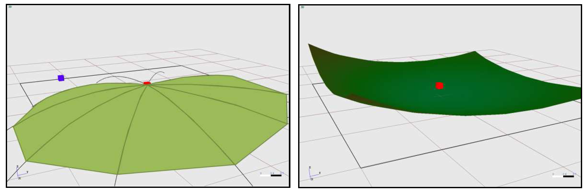
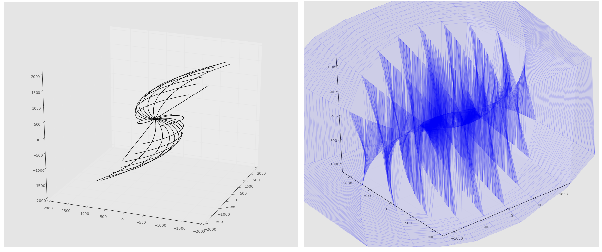
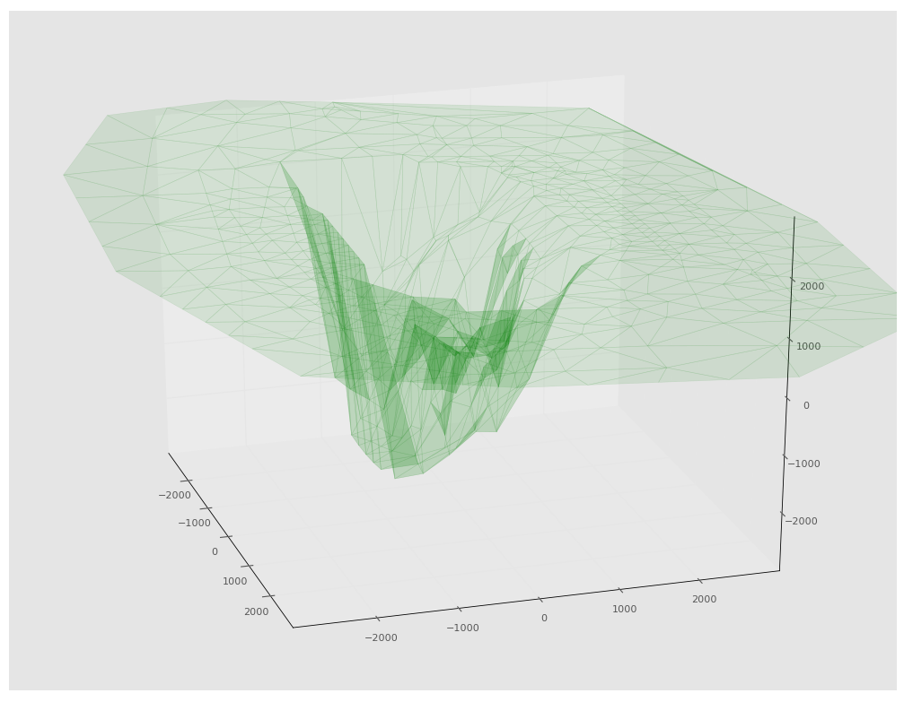

.. _ongoingwork-part:

Ongoing work
############

Factorisation of altimetry updates
==================================

Please refer to ticket [1484188]_.

This section summarise which altimetry update snippets are found where
in the code and when they are invoked. This aims at factoring them out
and rationalise altimetry update around as few code variants and
semantic invariants as possible.

Edition of topography elements
------------------------------

In the classes :class:`TYCourbeNiveauEditor`,
:class:`TYEmpriseEditor`, :class:`TYPlanEauEditor` we find the same
altimetry update pattern.

In the :func:`slotKeyPressed` methods of the tree classes:

.. code-block:: cpp

    ((TYSiteModelerFrame*)_pModeler)->getSite()->updateAltimetrie();
    ((TYSiteModelerFrame*)_pModeler)->getSite()->updateAltiInfra();
    ((TYSiteModelerFrame*)_pModeler)->getSite()->updateGraphic();
    _pInteractor->updateGL(); // ??? to be excluded

In the :func:`TYCourbeNiveauEditor::endCourbeNiveau` and
in the :func:`TYPlanEauEditor::endPlanEau` (**but not**
in the :func:`TYEmpriseEditor::endEmprise`):

.. code-block:: cpp

    // On altimetrise aussi le sous-site (si s'en est un !)
    if (!pSite->getRoot()) { pSite->updateAltimetrie(true); }

    // On met a jour l'altimetrie globale du site
    TYProjet* pProjet = getTYApp()->getCurProjet();
    if (pProjet)
    {
        pProjet->getSite()->updateAltimetrie(true);
        pProjet->getSite()->updateAltiInfra(true);
        pProjet->updateAltiRecepteurs();
        pProjet->getSite()->getTopographie()->updateGraphicTree();
    }

In contrast in :func:`TYSolEditor::endSol` methods:

.. code-block:: cpp

    for (unsigned int i = 0; i < tabPts.size(); i++)
    {
        tabPts[i]._z = 0.0;
        pSite->getTopographie()->getAltimetrie()->updateAltitude(tabPts[i]);
    }

.. warning:: The main display problem for ground material is likely to
             come from here !!!

With receptors update
---------------------

In :func:`TYPickEditor::showPopupMenu`:

.. code-block:: cpp

    // On altimetrise aussi le sous-site (si s'en est un !)
    if (pSiteParent && !pSiteParent->getRoot()) { pSiteParent->updateAltimetrie(true); }

    // On met a jour l'altimetrie globale du site
    TYProjet* pProjet = getTYApp()->getCurProjet();
    if (pProjet)
    {
        pProjet->getSite()->updateAltimetrie(true);
        pProjet->getSite()->updateAltiInfra(true);
        pProjet->updateAltiRecepteurs();

        pProjet->getSite()->getTopographie()->updateGraphicTree();
    }

is very similar to (in :func:`TYSiteFrame::contextMenuEvent`):

.. code-block:: cpp

    if (pSiteParent)   // Non NULL uniquement pour les courbes de niveau et les plan d'eau
    {
        // On altimetrise aussi le sous-site (si s'en est un !)
        // WIP
        if (!pSiteParent->getRoot()) { pSiteParent->updateAltimetrie(true); }

        // On met a jour l'altimetrie globale du site
        TYProjet* pProjet = getTYApp()->getCurProjet();
        if (pProjet)
        {
            pProjet->getSite()->updateAltimetrie(true);
            pProjet->getSite()->updateAltiInfra(true);
            pProjet->updateAltiRecepteurs();

            pProjet->getSite()->getTopographie()->updateGraphicTree();
        }
    }

Only updateAltimetry()
----------------------

In :func:`TYOpenElementDialog::openElement`:

.. code-block:: cpp

    // Directement site courant, la "place" etant libre
    LPTYSiteNode pSite = TYSiteNode::safeDownCast(pElt);
    if (pSite)
    {
        getTYApp()->setCurSiteNode(pSite);
        pSite->updateAltimetrie();
    }

The most complex one
--------------------

In :func:`TYSiteNode::update`:

.. code-block:: cpp

    // Mise a jour de l'altimetrie du site principal
    updateAltimetrie(force);

    // Altimetrisation des infrastructures du site
    updateAltiInfra(force);

    // Mise a jour de l'acoustique des elements du site
    updateAcoustique(force);

    // Et celle des sites inclus
    for (unsigned short i = 0; i < _listSiteNode.size(); i++)
    {
        TYSiteNode* pSite = TYSiteNode::safeDownCast(_listSiteNode[i]->getElement());

        if (pSite && pSite->isInCurrentCalcul()) { pSite->update(force); }
    }

    // Si le site est dans un projet, on altimétrise les points de controle
    if (_pProjet)
    {
        TYCalcul* pCalcul = _pProjet->getCurrentCalcul()._pObj;
        assert(pCalcul);
        pCalcul->updateAltiRecepteurs();
    }

.. [1484188] https://extranet.logilab.fr/ticket/1484188

TODO
===========

Transformation of the scene and Triangulation
------------------

To take into account the impact of the weather (temperature and wind gradient) on the propagation of the rays, tympan launches 20 curved rays from one of the sources.
The trajectory of those curved rays is computed using a 4th order Runge-Kutta approximation. Those curved rays are used to build a transformation sheet (see below) which reflects how the weather impacts the altitude of the rays.

    **Left:Transformation sheet, Right: Transformed scene**

The triangulation algorithm used to build the transformation sheet only uses 2D coordinates and ignores the z-axis. As we can see on the figure below, when the gradients are too high the curved rays wrap onto themselves modifying the topological order of vertices in the x,y 2D plane.
Since the triangulation ignores the z-axis it connects vertices that are very close in the x,y 2D plane but far apart on the z-axis. This produces a very chaotic transformation sheet. 
It can go as far as creating holes in the sheet which are responsible for the weird rays going through the ground that have been occasionally produced by the simulation.

    **Curved rays and their corresponding transformation sheet**

The approximation of the weather's impact also presents the problem of only being valid for rays launched from a source close to the one used for producing the curved rays used as a frame for the transformation sheet.
As we can see on the figure below, the transformation results in a deep hole in the scene. Rays launched from outside this hole will follow a wrong trajectory not reflecting the impact of the weather.

Simulation summary and diagnostic
------------------

So far the statistics on the rays (number of valid rays, invalid rays, number of rays invalidated by each selectors etc...) have been hard coded and which is not flexible.
It could be useful to have an object regrouping these kind of statistics and capable of producing a report.

Displaying the rays processed by the ray tracing algorithm with the possibility of selecting them according to some criterion (src/rcpt, valid/invalid, which selector invalidated, number of events etc...) could be helpful when investigating the behavior of the simulation. Moreover, some comments could be attached to the events of the rays to give information on the ray's journey.

The ids of the sources and receptors in the scene are different from the ones returned by the results of the simulation. This makes the analysis of the results unnecessarily difficult.

Performances
------------

The performance tests have shown that most of the computation time is spent computing intersections. It might be worth investigating if the intersection methods of the various shapes can be optimized.

The page http://www.realtimerendering.com/intersections.html contains a lot of resources on this subject.

Besides, both the accelerators and the ray tracing algorithm could be parallelized to improve the performances.

Co-Planarity Selector
---------------------

Finish implementing the co-planarity selector.

This selector rejects a ray if the face if its ith event is co-planar with the face of the ith event of any of the other already selected rays that have the same event signature.

Tests Anime3D
-----------------

The following modules lack unit tests:

    - DefaultCurvrayEngine
    - Geometry_modifier
    - Lancer
    - TYAnime3DAcousticMode
    - TYAnime3DAcousticPathFinder
    - TYAnime3DConversionTools
    - TYAnime3DRayTracerSolverAdapter
    - TYAnime3DSolver

Linear Algebra/Geometric computations:
---------------

The geometric computations in 3D space are done with an ad-hoc library. Although no critical bug has been discovered through the unit tests, it would be better for Tympan to rely on one of the proven linear algebra/geometric computation libraries.

Here is a list of some of the most popular libraries:

+------------------+---------------------------+---------------------------------------+                                    
| Library          | Advantages                | Downsides                             |          
+==================+===========================+=======================================+                                    
| | GMTL           | | Simple API              | | Focused on graphics rendering       | 
| |                | | Fast                    |                                       |    
+------------------+---------------------------+---------------------------------------+                                                       
| | Eigen2/3       | | Clean API               | | No graphics rendering               | 
| |                | | Fast                    |                                       |  
+------------------+---------------------------+---------------------------------------+                       
| | IMSL           | | Very Fast               | | No geometric specific methods       |
| |                | |                         | | Not free                            |
+------------------+---------------------------+---------------------------------------+ 
| | NT2            | |                         | | Not as fast as the others           |
| |                | |                         | | Poorly maintened/documented         |             
+------------------+---------------------------+---------------------------------------+ 
| | LAPACK         | | Stable and proven       | | Poor API                            |                                    
+------------------+---------------------------+---------------------------------------+           

More information on this topic can be found at the following adresse:
    - https://en.wikipedia.org/wiki/Comparison_of_linear_algebra_libraries
    - https://stackoverflow.com/questions/1380371/what-are-the-most-widely-used-c-vector-matrix-linear-algebra-libraries-a
    - https://scicomp.stackexchange.com/questions/351/recommendations-for-usable-fast-c-matrix-library

Miscellaneous:
---------------

The purpose and inner workings of the path difference option is still a mystery. It is used to invalidate some intersections, but the reason behind it are not documented and the code does not help infer the physical problem it tries to solve nor the theory it is based on. It should be studied further or simply removed from the code.

The DiffractionPathSelector also lacks theoretical motivation. Although its code is clear enough to understand what it does, we still do not know what its purpose is. 
Besides, it is redundant with the constraints applied to intersections when they are validated (pathDiffValidationForReflection and pathDiffValidationForDiffraction methods of ValidRay), therefore rays meeting the rejection conditions of this selector should have been eliminated before reaching the selector manager. 

The DiffractionAngleSelector presents the same curiosity.The diffracted rays are already filtered at the generation step with the same conditions. Therefore, as for the DiffractionPathSelector, its unclear why the DiffractionAngleSelector finds any ray to reject.

Documentation's TODOs
=====================

This section lists all ``..todo::`` markers through the developers'
documentation.

.. todolist::
