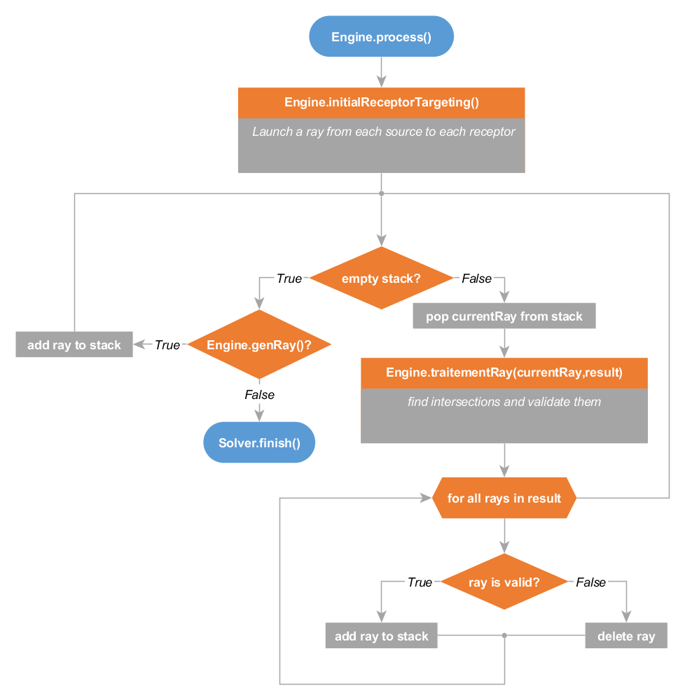
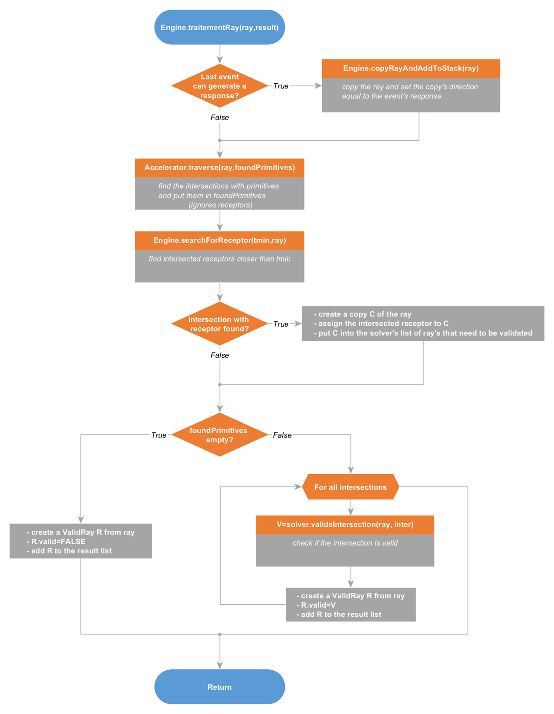
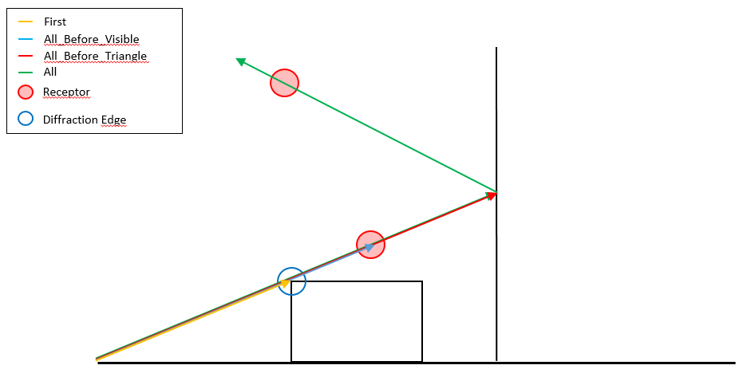
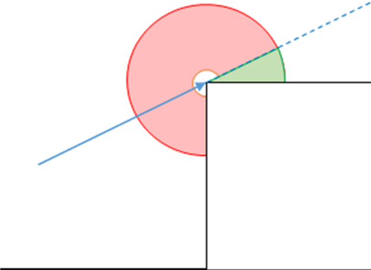
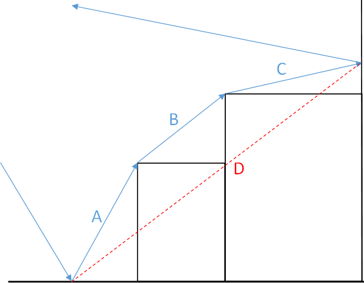
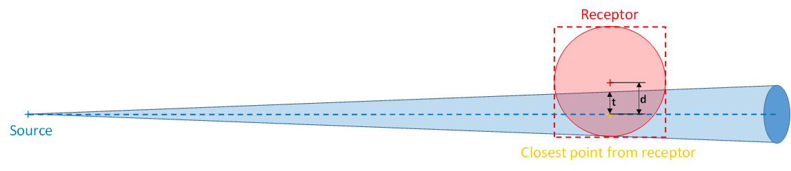
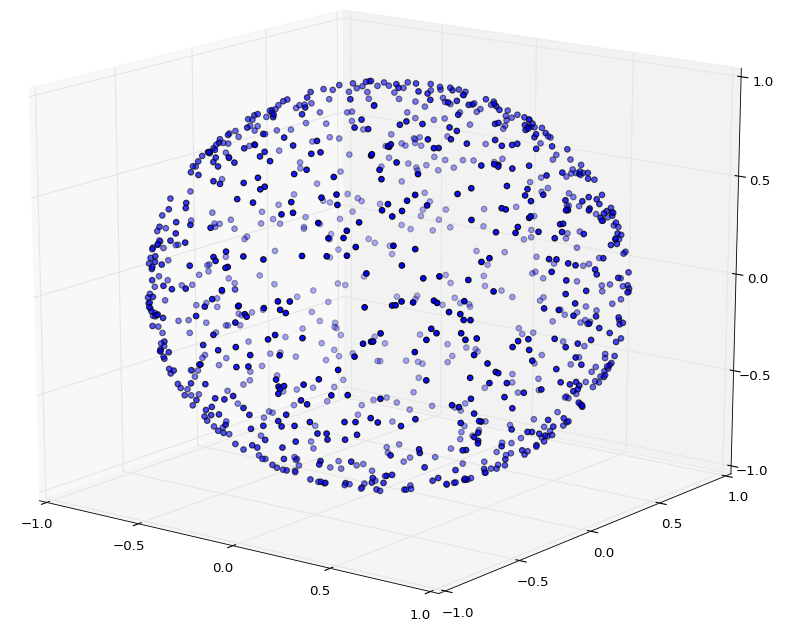
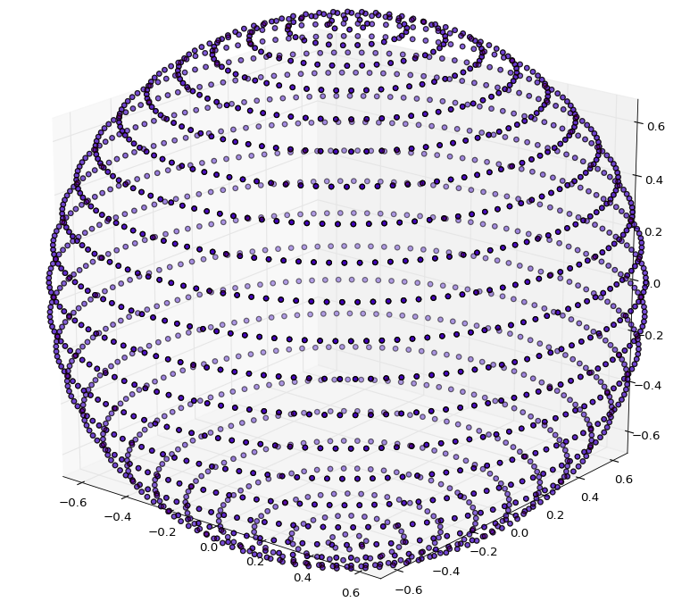
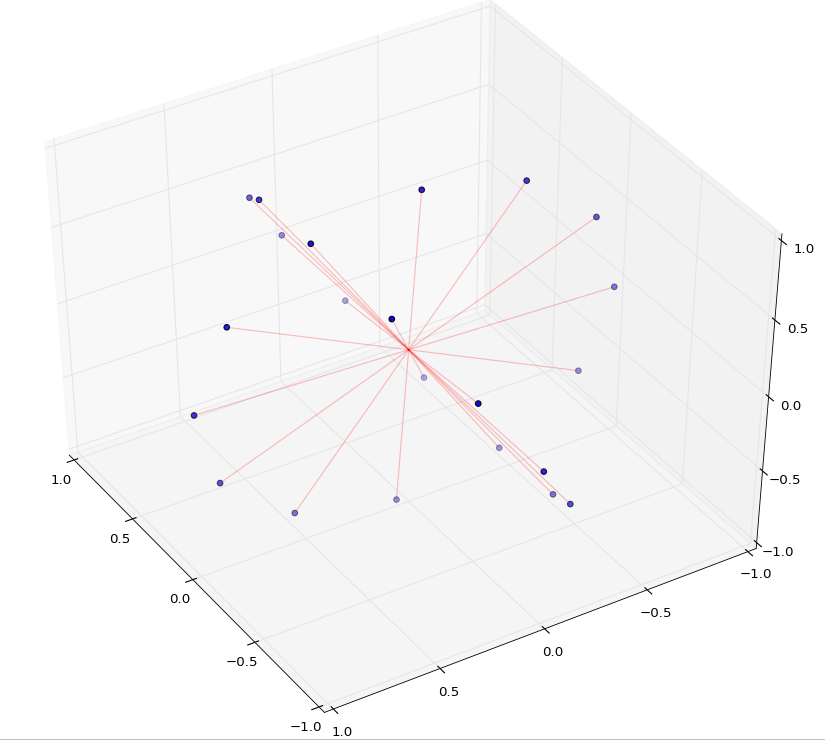
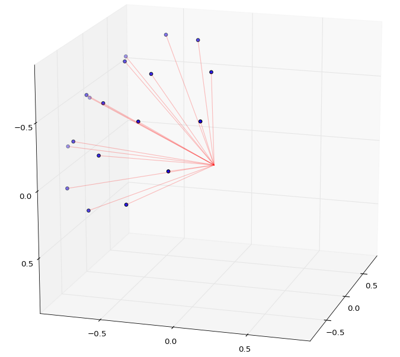

.. ray_tracing_algorithm:

The Ray Tracing Algorithm
*************************

Introduction
############

The aim of this document is to give an overview of how the ray tracing
algorithm is implemented in Tympan and to discuss the none trivial ways in
which some aspects of the simulation are implemented.

Conceptually, the ray tracing simulation launches rays from some sources and
then propagates them through the scene. Each time a ray intersects with an
element of the scene the simulation handles how the ray should react to the
interaction by modifying its course or generate new rays. Rays stop their
course once they reach a maximum length or, depending on how intersections are
handled, when they hit a receptor.

The first part of this document presents the main loop which generates most of
the rays, loops through them for treatment and then deletes invalid rays while
putting back in the stack valid rays that haven’t finished to run their course
yet.

The second part discusses the processing of the rays, which consists mainly in
finding the intersections with the scene, validate them and return the rays
augmented with events corresponding the type of primitive intersected.

The third part explains how intersections with the scene are handled and how
the corresponding events are generated.

Finally the fourth part describes the filters that are applied to rays that
have run their course to decide which ones should be discarded.

Before diving deeper into the explanations of the ray tracing implementation,
here is a list of some of the non trivial implementation choices that should
be kept in mind when trying to understand the code:
  - The main loop is not the only place where rays are added to the stack. In order to not overload the memory, rays produced by diffraction events are handled at the beginning of the traitementRay() function.
  - Receptors are put in their own scene because intersections of the rays with them are handled separately from the intersections with the other primitives of the scene.
  - Rays that have been invalidated during their processing are deleted in the main loop, but this is in the searchForReceptor() that they are sent to the selector manager for validation.
  - The Diffraction Angle Selector performs the same tests than the responseAngleLimiter() function called when validating diffraction events. Although this seems redundant, the reason for this is that ignoring rays that do not meet the angle constraints a soon as possible avoids spending computation time dealing with rays that will be rejected anyway.

Main Loop
#########

   **Main loop of the ray tracing simulation**

The above flowchart outlines the algorithm of the main loop of the ray tracer
(the process() method of the Engine class).

The first step consists in creating rays going from each source to each
receptor and putting them into a stack. Then, rays are pulled from the stack
for treatment one by one until the stack is empty. Each ray is processed by
the traitementRay() method of the Engine class which looks for the
intersections of the ray with the scene, validates those intersections and
updates the ray accordingly(see `Ray Processing`_). Invalid rays returned by
DefaultEngine.traitementRay() are deleted while valide ones are added back to
the stack for further processing.

When the stack is empty, the method genRay() of the Engine class is called and
tries to generate a new ray. If all sources have generated all the rays they
can, then the simulation is over and the finish method of the Solver is
called.

Note : This is the only place in the code where rays are removed from the
stack. On the other hand, beside the two places where rays are added to the
stack in the present function, rays can also be pushed to the stack by the
method DefaultEngine.copyRayAndAddToStack() (which is used to deal with rays
generated by diffraction events (see `Ray Processing`_).

Ray Processing
##############

The above flowchart outlines the algorithm of the
DefaultEngine.traitementRay() method used to process rays. This method
performs four operations :

    - Generate new rays based on the responses of the last event (only in the case of diffractions)
    - Find intersections of the ray with the primitives of the scene (except receptors)
    - Find intersections of the ray with receptors
    - Validate intersections and add the corresponding events to the ray

The responses of the events are the directions in which rays should be
launched after interacting with an element of the scene.

In the case of reflection events, only one ray is produced : the reflected
one. This is done during the intersection validation step by adding a
reflection event to the ray and modifying its direction. Similarly, when a
diffraction event is validated, it is added to the current ray and its first
response is used to produce a new direction for the current ray.

The rest of the responses of a diffraction event could be handled at the same
moment, in a trivial way, by adding all diffracted rays to the stack. This
would run the risk of overloading the stack by adding too many rays while
processing too few of them.

To prevent this from happening, the handling of the remaining responses of the
diffraction events is postponed to the next call of
DefaultEngine.traitementRay() on the current ray after it has been enriched
with the diffraction event. Before looking for intersections, the number of
responses left of the event is checked. If the current ray can still generate
responses, it is copied and the next response of the event is used to generate
the direction of the copy which is then pushed to the stack. The remaining
responses will be handled when DefaultEngine.traitementRay() will be called
on the copy of the current ray.  In this way, each response is handled
individually and needs to be processed before the next response can be used to
generate another ray generated (when the copy is processed by a later call of
DefaultEngine.traitementRay()). Hence, for a particular diffraction event,
only one of the rays it generates can hang in the stack at a given time.

Finding the intersections with the primitives and the receptors is done in two
separate steps. The reason for this is that, when a ray hits a receptor it is
immediately passed through the selectors for validation. On the overhand, rays
that hit other primitives of the scene need further processing to validate the
intersections and generate the corresponding events.

By default, only the first intersections encountered is returned,  but the
accelerating structures used to efficiently find the intersections can be
configured with a leafTreatment option which controls if all intersections
should be returned or only some of them (for more details see `Intersections
Handling`_).

The traverse() function that searches for intersections also takes a tmin
argument which controls the maximum distance above which intersections are
discarded. The tmin of an intersection corresponds to how many times the
direction of the ray has to be multiplied to reach the intersected shape. By
default, when using the keepFirst leaft treatment, the traverse() function
returns the tmin of the closest intersection. Other leafTreatment options
might return a tmin that corresponds to a different intersection (for more
details see `Intersections Handling`_).

Finally the intersection validation step generates the events corresponding to
the type of primitives intersected (reflections for triangles and diffractions
for cylinders) and tries to validate them. The method valideIntersection() of
the Solver is then called on each intersection with a copy of the current ray.
This method validates the intersection and updates the ray accordingly (see
`Intersections Handling`_ for more details). Its result is used to set the
"valid" flag of the ray which will in turn be used to decide if must be added
back to the stack or deleted in the Engine.process() method.

Intersections handling
######################

There are two aspects to intersections handling :
  - Which intersections are considered relevant
  - How those intersections are validated and used to generate events

Relevant intersections and the leaftTreament option of the accelerating structures
==================================================================================

The primitives of the scene are organised into an accelerating structure which
allows to efficiently retrieve the intersections of the ray with them. While
the inner workings of the different accelerating structures do not impact
how the ray tracer behaves, the result of the simulation depends in part on
which intersections with the scene are considered relevant. For example, it
could be decided that we are interested only in the first intersection
encountered. On the contrary, it might be that in all intersections are
relevant. Such a behavior is controlled by the leafTreatment option of the
accelerating structure.

Four different types of leaftTreatment can be used :
    - **FIRST** : returns the first intersection encountered with its tmin
    - **ALL_BEFORE_VISIBLE** : returns all intersections encountered before intersecting a visible primitive. The returned tmin is the one of the intersection with the invisible shape. (all primitives but the cylinders used for the diffraction edges are visible)
    - **ALL_BEFORE_TRIANGLE** : returns all intersections encountered before intersecting a triangle. The returned tmin is the one of the intersection with the triangle.
    - **ALL** : all the intersections encountered are returned. The returned tmin is the one of the first intersection.

The figure below shows how each of the different choices of leafTreatment
condition which intersections are returned  when traversing the accelerating
structures.

   **Impact of the leaf treatment option on the intersections discovered**

As we can see, the **FIRST** option stops at the first intersection encountered
(orange ray).

**ALL_BEFORE_VISIBLE** intersects the invisible diffraction edge an keeps going
until the first receptor, therefore it would return two intersections (blue
ray).

**ALL_BEFORE_TRIANGLE** goes past the first receptor and stops at the first
triangle encountered when the ray hits the wall on the right. In this case
three intersections would be returned, one with the diffraction edge, one with
the first receptor and one with the triangle of the wall (red ray).

Finally the **ALL** option does not stop at any intersection and returns all of
them (green ray).

Intersections validation and event generation
==============================================

The intersection validation step decides which event will be added to the ray
in function of the intersected primitive :
    - a reflection event for an intersection with a triangle
    - a diffraction event for an intersection with a cylinder

Case of an intersection with a triangle
---------------------------------------

There are three different ways an intersection with a triangle can be considered invalid :
    - If the ray has already reached its maximum number of reflections
    - If the intersected triangle is part of the ground and reflections on the ground are disabled
    - If the addition of a reflection event at the position of the intersection would render the path difference bigger than the threshold provided in the ray tracer configuration (this test is performed only if the UsePathDifValidation flag is set to true in the configuration)

The path difference corresponds to the difference between the length of the
ray and its length when ignoring diffraction and taking the direct path
between reflections/current impact  (see `Diffraction Path Selector`_ for more
details).

If the intersection passes those validation conditions, a reflection event is
created and added to the ray. The position and the direction of the ray are
updated with the response and the position of the event (reflection events
only have a single response).

Case of an intersection with a cylinder
---------------------------------------

Intersections with cylinders can be invalid in three different ways :

  - If the ray has already reached its maximum number of diffractions
  - If the addition of a diffraction event at the position of the intersection would render the path difference bigger than the threshold provided in the ray tracer configuration (this test is performed only if the UsePathDifValidation flag is set to true in the configuration)
  - If the responseAngleLimiter flag is set to true and no response from the event lies in the shadow of the obstacle

In the figure below, the blue arrow corresponds to the ray and the dashed line
to its extension. The shadow of the obstacle corresponds to the green area.
The red area is the remainder of Keller’s cone along which responses are
created.
 

    **Diffraction angle limitation and shadow of an obstacle**

The idea behind this limitation of the angle of the responses is that
diffracted rays carry a lot less energy than direct ones. Therefore the impact
of diffracted rays in term of acoustic pressure is insignificant in comparison
direct rays.

Note that, by construction no response provided by the diffractions events
point inside the obstacle. The angle limitation only concerns the shadow of
the obstacle

Selectors and Ray Validation
############################

When a ray hits a receptor it is added to the selectorManager which passes the
ray through filters called selectors. Each selector tests if the ray meets
some conditions and can either accept, reject or replace a ray. If a ray is
rejected by any of the selectors, it is then considered invalid. Otherwise it
is added to the list of valid rays (after having been replaced by a ray that
meets the constraints in the replace case).

Cleaner Selector
=================

This selector does not reject any ray. It either accepts them (if they have no
events) or it replaces them with an equivalent ray stripped of all DoNothing
events.

Close Event Selector
=====================

This selector rejects a ray if two of its consecutive events occur on the same shape (for
example a diffraction close to a reflection)

Diffraction Selector
====================

Rejects the rays that have a number of diffraction events greater than a given
threshold.

Diffraction Angle Selector
===========================

Rejects diffracted rays that do not propagate in the shadow of the obstacle
causing the diffraction.

This selector is redundant with the tests performed to prevent diffracted rays to be launched outside of the shadow of the obstacles when they are generated.

Diffraction Path Selector
=========================

Rejects rays if the path difference of the ray  exceeds some threshold. The
path difference is equal to the difference between
    - The length of the ray from source to impact
    - The length of the ray from source to impact taking a direct path between reflections/current impact while ignoring diffractions

    **Path difference of a ray**

This selector is redundant with the tests performed by the pathDiffValidationForReflection and pathDiffValidationForDiffraction methods of ValidRay when validating intersections.

Face Selector
=============

If several rays have the same face/primitive history, this selector only accepts the shortest one and rejects the others.

Fermat Selector
===============

Rays can be seen as long cones that get thicker as their length increases
based on their associated solidAngle (which depends on the source and the
number of rays launched). This selector rejects rays if the receptor they hit
does not lie in the thickness of the ray.

Example :

    **Fermat selector**
 
In the above example,  the ray (dashed blue) hits the receptor’s bounding box
(dashed red). The distance *d* between the receptor’s position (red cross) and
its closest point on the ray (orange cross) is larger than the ray’s thickness
divided by two (*t*). In this case, the ray is rejected.

Length Selector
===============

Simply rejects rays that have traveled a distance greater than a given
threshold.

Reflection Selector
====================

Rejects the rays that have a number of reflection events greater than a given
threshold or that reflect on the ground (if it is disabled).

Samplers
############################

The ray tracing algorithm can use four types of planes samplers which are described below.

Random Sampler
====================

The random sampler generated rays in a uniform way on the unit sphere. It takes care of not generating a higher density of rays at the poles.

Example :

    **Random sampler**

Uniform Sampler
====================

The uniform Sampler launches rays on the unit sphere in a uniform but also determinsitic manner.
The sphere is divided into slices and the rays are launched on the corersponding circles.

This is the default sampler for all sources but the ones one emitting surfaces.

Example :

    **Uniform sampler**

Plane Sampler
====================

The plane sampler launchs rays in the vertical and horizontal planes. Thos two planes are oriented using the source's direction.

Example :

    **Plane sampler**

Beam Sampler
====================

The beam sampler launches rays in a cone oriented with the direction of the sphere.

It is used by emitting surface to launch rays in a hemisphere. Its aim is to prevent those surfaces from generating rays backward that bounce back on them just after having been launched.

Example :

    **Beam sampler**